```{=html}
<style>
.list-group-item.active, .list-group-item.active:hover, .list-group-item.active:focus {
  background-color: #00d188;
  border-color: #00d188;
}

body {
  font-family: montserrat;
  color: #444444;
  font-size: 14px;
}

h1 {
  font-weight: bold;
  font-size: 28px;
}

h1.title {
  font-size: 30px;
  color: #00d188;
}

h2 {
  font-size: 24px;
}

h3 {
  font-size: 18px;
}
</style>
```


# TikTok Guide for Businesses (2021)

**[TODO: Other title suggestions]**

With over 2 billion downloads and over 1 billion monthly active users, TikTok has marked itself as one of the biggest social media platforms in just a couple of years.

And while the platform itself enjoys immense popularity, especially among Gen Z users, businesses have been slow to expand their social media marketing machines to the nascent video sharing platform.

To help you tailor your TikTok marketing strategy, we studied over 300 brands and more than 650 videos from the top TikTok brands to figure out how companies like Amazon, Apple, Samsung, and Chevrolet manage their TikTok presence and what works on the platform and what doesn't.

Specifically, we looked at

-   which of the most valuable brands had a TikTok presence
-   how often these brands were posting on TikTok
-   channel and video-level metrics for these brands
-   what the style, tone, and content of the best performing TikTok videos were.

Without further ado, let's dive into what we found.

[**TODO:** Move Key Takeaways from the bottom to here. It's there now because it depends on the code and putting it here would cause errors.]

[**TODO:** Add methodology section here or at the bottom. Do you have a preference?]

## Half of the Top Brands Don't Have a TikTok Presence Yet

Of the 317 brands we studied, nearly **50% either didn't have a TikTok account or had zero posts** on their account. This included billion-dollar brands like Google, Facebook, YouTube, IKEA, Nestlé, Audi, Toyota, and more.

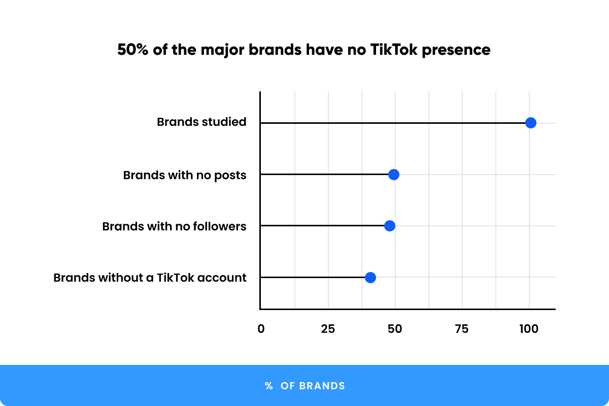


That's a rather significant gap in the market, and **establishing an early TikTok presence** can be the source of a **significant marketing advantage** for your brand and potentially even allow you to leapfrog much larger brands which have simply ignored the platform so far.

**Key takeaway:** Despite its incredible popularity, many brands still don't have a coherent TikTok strategy. Make sure you aren't one of them.

## The best brands post around 3 times per week

As with YouTube, TikTok's algorithm rewards frequent and consistent posts.

We found that, on average, the best-performing TikTok brands (those with 10,000 or more average views per post) released a **new video 3.16 times per week**.

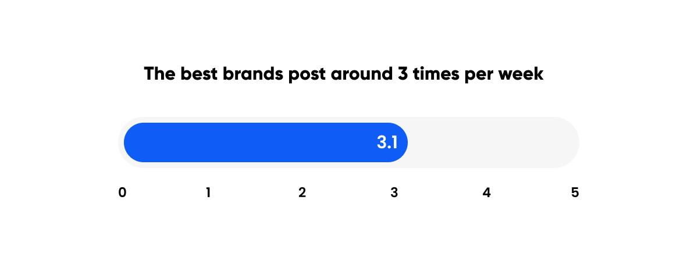

While doing more than 5 posts per week is likely not going to make much of a difference, there are exceptions.

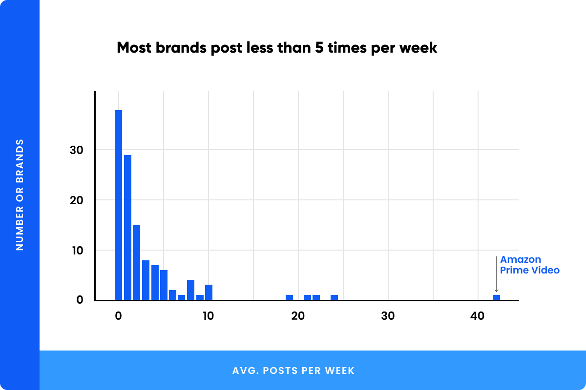


Over to the very right of the graph is Amazon Prime Video, which not only posts more than 40 times per week but also draws an average of 1.32 million views per post.

These are mostly snippets and previews of its current and upcoming shows, however, and it's unlikely that most business will have as much content as the streaming platform.

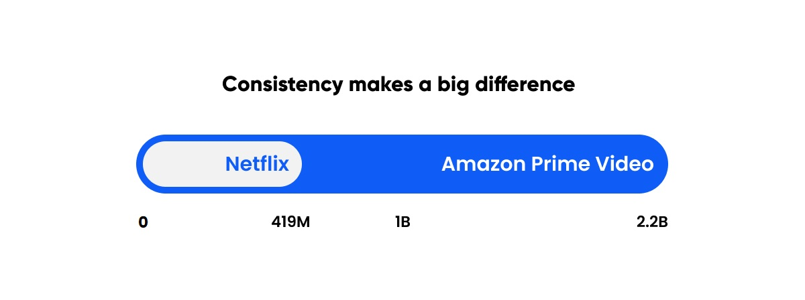

[**TODO: change title of plot**]


Interestingly, the only other brand that could take Amazon Prime on, Netflix, posts far less often (8.5 times per week) and the difference shows. While Netflix's TikTok account has accumulated a total of 419M views, Amazon Prime sits at a pretty 2.2 billion views, mainly because of its more consistent rate of posting.

**Key takeaway:** Post at least three times a week and make sure to be more frequent and consistent than your competitors.

## How many views is a single follower worth?

The number of followers a brand has is, of course, highly correlated with the average views and engagement their posts generate.

The larger your audience, the more likely you are to get shares, likes, and comments for your videos. In short, going viral is easier with a larger following, and building a large and dedicated fan base should be one of the top priorities for your channel.

This begs the question, though: just how important is gaining one additional follower?

You might have seen some brands running giveaways and raffles which requires users to follow them on social media in order to participate.

Say you could run a similar giveaway which cost you \$X to get one more follower. What would the return on investment for that money be? Can we quantify that?

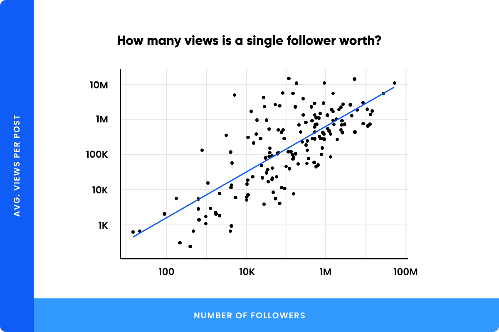

**[TODO: chart title]**


Thankfully for you, we did just that, and based on the regression line you see above, a **1% increase in followers corresponds to a 0.65% increase in average views per post**.

Say you currently have 100 followers, and you run a \$500 giveaway to get an additional 20 followers. That's a 20% increase in followers, and you can expect, in return, an approximately 13% increase in the number of views your posts generate.

**Key takeaway:** Running paid campaigns and giveaways to attract followers might be a good way to boost the overall reach of your content.

## Tech, Food, and Gaming brands perform the best on TikTok

Next, we wanted to look at which types of brands performed the best on TikTok.

So, we computed the average number of views each brand got on their videos and then found the average of this average for the different types of industries each brand belonged to.

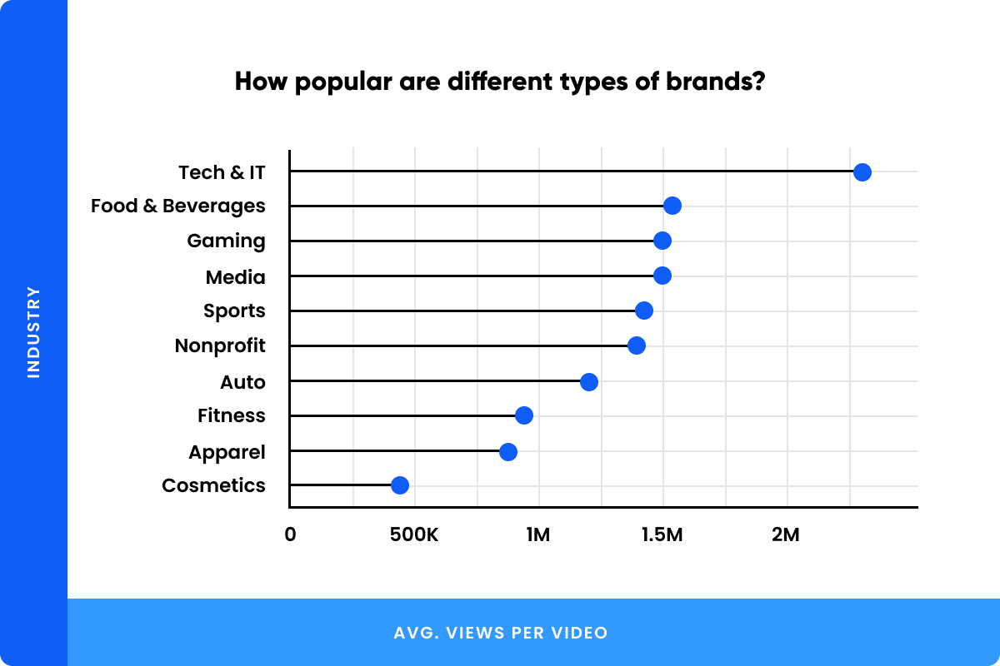


The results showed that **Tech & IT brands** seemed to perform the best, drawing **more than 2.3 million views per post**, followed by Food & Beverages, Gaming, and Media.

That's not to say that you need to be a billion-dollar tech company to succeed on TikTok. As with other social media platforms, TikTok rewards creativity far more than anything else.

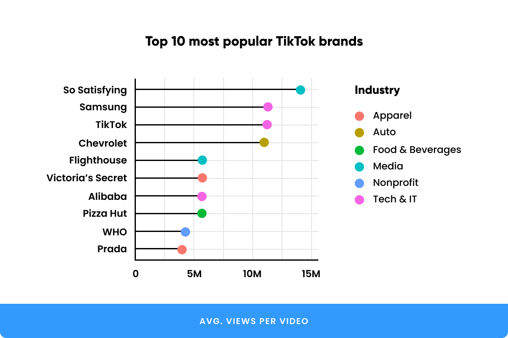


In fact, the most popular TikTok brand that we studied was So Satisfying, whose videos generate 14M videos on average, and they're all about making the most mundane of things look sexy.

Here's their best performing video (with 76 million views!) about a particularly interesting type of shoe:

[embed video: [https://www.tiktok.com/\@sosatisfying/video/6828726014307257606](https://www.tiktok.com/@sosatisfying/video/6828726014307257606)]


It's not all that surprising to see TikTok made the cut. In fact, 5 of the top 10 videos by views were from TikTok's own account. Since we only studied the 5 most viewed videos from each brand, that's basically a 100% success rate.

So, if you're going to take your TikTok cues from any single brand, go check out [\@TikTok](https://www.tiktok.com/@tiktok/) --- after all, they made the platform!

Another interesting entry on the list is the World Health Organization. Sure, the ongoing pandemic has probably contributed significantly to their popularity, but they are, nonetheless, a great example of a non-profit using TikTok to run social awareness campaigns --- and not just about COVID-19.

Here's a great video from the WHO about the tobacco industry and the dangers of smoking in general. The post drew over 54 million views and is an excellent example of a voiceover video with some really amazing video editing and graphics to boot:

[embed video: [https://www.tiktok.com/\@who/video/6832233774097517830](https://www.tiktok.com/@who/video/6832233774097517830)]


**Key takeaway:** the industry you operate in can have an impact on your views, but creativity is the ultimate yardstick for TikTok success.

## Music Makes the Video

TikTok videos thrive on music. Of the nearly 650 videos we studied, almost 80% of the posts had music.

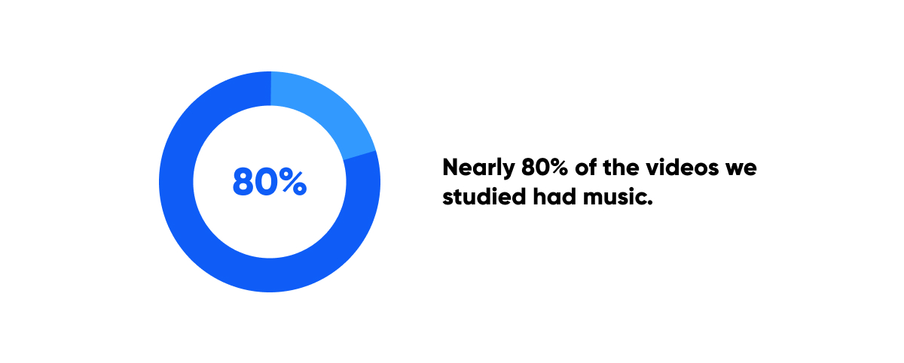


Additionally, it seems that upbeat music is the most popular choice by far, which isn't all that surprising when you consider that TikTok owes a large part of its popularity to dance videos.

[**TODO:** Choose chart title from two options]

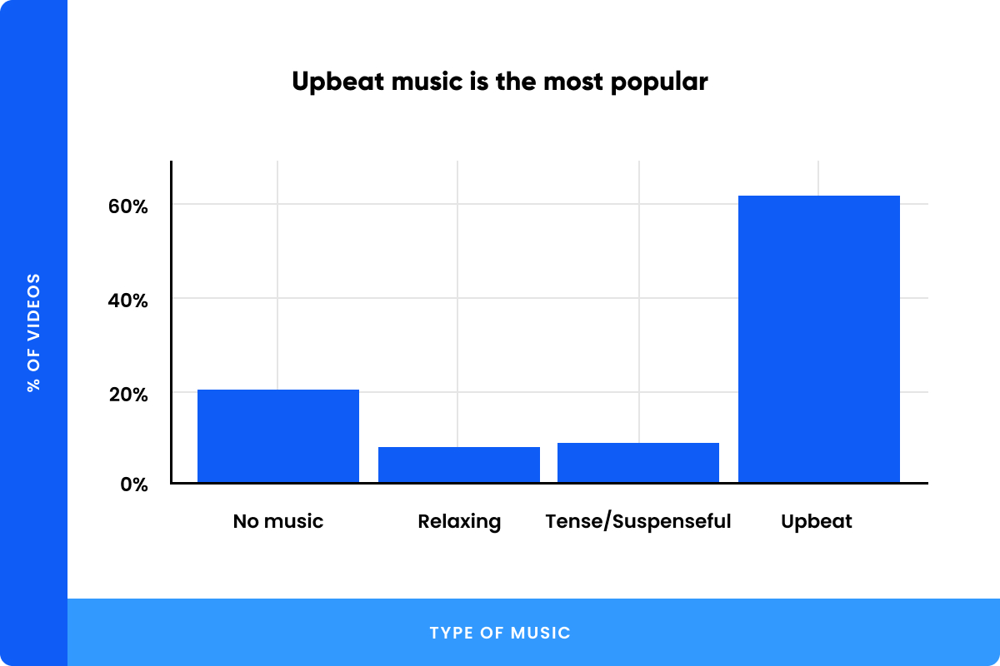


Add some music and even something as mundane as you cutting grass can attract 20.9M views.

[embed video: [https://www.tiktok.com/\@aldrichlandscape/video/6868589417318075653](https://www.tiktok.com/@aldrichlandscape/video/6868589417318075653)]


In fact, the folks at [Adrlich Landscape](https://www.tiktok.com/@aldrichlandscape/) have made a whole channel around this --- and they're doing exceptionally well on the platform. Just goes to show that you don't need to be a multi-billion dollar business to succeed on social media; a little bit of creativity goes a long way.


**Key takeaway:** Try and add music to all your videos --- the choice of music is also pretty important, with upbeat tunes generating the most buzz for posts.

## Is there a Recipe For the Perfect TikTok Post?

All this begs the question: is there a recipe for crafting a TikTok post that's just right?

While there obviously isn't a perfect formula for creating a viral video --- if there was, everyone would be using it! --- we did study the style, content, and mood of the top 5 videos from each brand to identify the common traits shared by the most successful TikTok videos.

First, let's examine the types of content that are the most popular among brand videos --- and how many views they attract in general.


### Which types of content are the most successful brands producing?

As you'd expect from brands, an overwhelming majority of their posts showcase one or more products. In fact, over **90% of the videos we studied had some form of brand placement**.

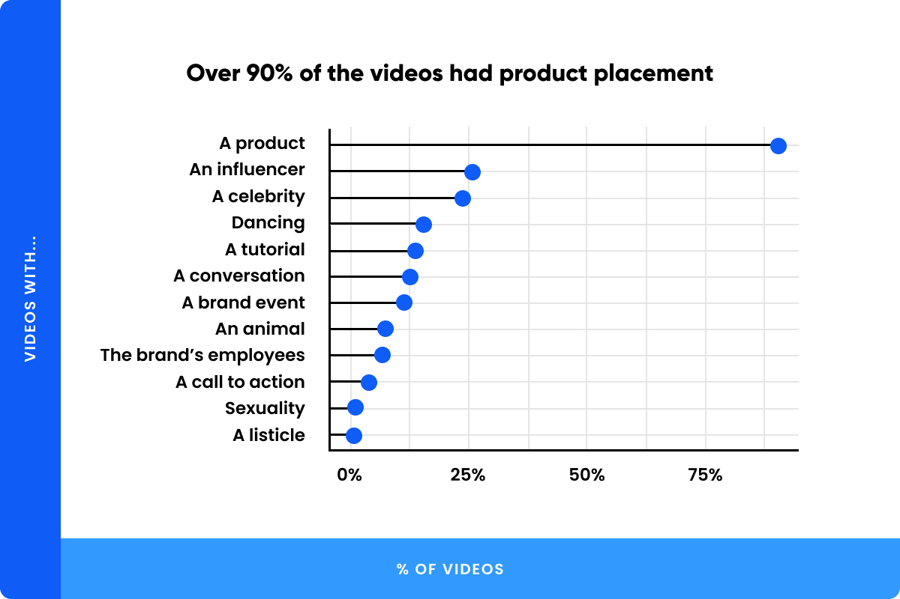


So, don't feel shy about advertising your brand and your product in your posts. After all, that's the whole point of social media marketing!

Here's a great example of product placement from Pizza Hut, which earned the brand over 64 million views:

[embed video: [https://www.tiktok.com/\@pizzahut/video/6907646149507730693](https://www.tiktok.com/@pizzahut/video/6907646149507730693)]


Celebrity and influencer endorsements are also relatively popular among TikTok brands, with around a **quarter of the videos featuring either an endorsement or a collaboration**.

Dance videos and tutorials rounded out the top 5 most popular types of content, accounting for 15% and 14% of the videos, respectively.

Only **3.7% of the videos included a call to action**, a significant missed opportunity in our opinion. Asking your followers to follow your channel or reach out to you on other social media channels can do wonders and should always be something you consider when planning your videos.

Here's a great example from the Xbox channel --- with 6.6 million views! --- which masks their call to action (buying a subscription and downloading their app) as a tutorial:

[embed video: [https://www.tiktok.com/\@xbox/video/6901041087138303238](https://www.tiktok.com/@xbox/video/6901041087138303238)]


Alternatively, a call to action can be as simple as asking viewers to follow you for more content in the future:

[embed video: [https://www.tiktok.com/\@costcobuys/video/6921820981887536390](https://www.tiktok.com/@costcobuys/video/6921820981887536390)]


Either way, if someone made the effort to watch through your entire post, they presumably liked your content. Now's the time to capitalize on that goodwill and ask them to do something that generates value for your business!

Interestingly, sexual content was few and far better. Only 6 of the nearly 650 videos we analyzed employed some form of overt or subtle sexuality, with 5 of these coming from the same account (Victoria's secret).

As they say, though, sex sells. Even though the number of videos employing sexuality was small, the average number of views on these videos was extraordinary, with an average of **13.4 million views per post**.

Those numbers make sexuality the second biggest attention grabber among all the types of content we considered.

The posts that drew the largest numbers of eyeballs, though, were those which featured **promotions for a brand event**.

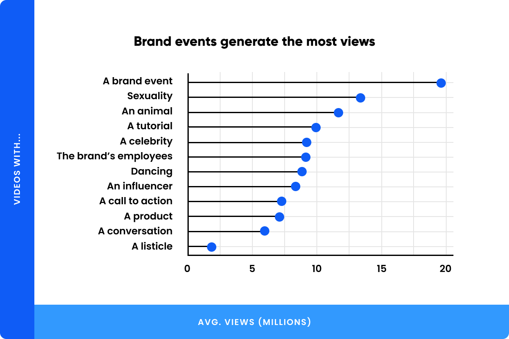


Remember how the 5 of the top 10 videos were studied were all from TikTok? Well, every single one of them drew more than 100 million views, and they were all promoting an upcoming event!

As with product placement, don't shy away from publicizing your upcoming brand events on TikTok. Not only are many of the most successful TikTok brands doing just that, but it seems like fans also love watching these posts.

Here's a great example of an event promotion post from TikTok's own account, which also does a great job of melding all of these elements together. It's got great music, a collab with an influencer, and even a helpful tutorial that people can follow if they want to participate.

[embed video: [https://www.tiktok.com/\@tiktok/video/6906565862132698370](https://www.tiktok.com/@tiktok/video/6906565862132698370)]


And while you may not have thought about it, the TikTok app is visible throughout the video --- an excellent example of showing off your product without being too on-the-nose about it.

Plus, it's for a good cause; no wonder it generated 129 million views!

Videos that include animals (or animal mascots) also do rather well on TikTok. For example, one of the top 10 most viewed videos was this joyful little bit with the Indianapolis Colts' mascot, Blue, giving folks a taste of some pie:

[embed video: [https://www.tiktok.com/\@blue/video/6797517710206029061](https://www.tiktok.com/@blue/video/6797517710206029061)]


The San Diego Zoo, too, has an extremely popular channel, often generating millions of views per post. Here's one of a kea putting my intelligence to shame:

[embed video: [https://www.tiktok.com/\@sandiegozoo/video/6819753891236728069](https://www.tiktok.com/@sandiegozoo/video/6819753891236728069)]


And if you're a brand, don't shy away from turning the lens on your employees (with their consent, of course).

Among the posts we studied, videos that showed a company's staff had, on average, **over 9 million views**.

These videos also put a human face to your firm, which is always priceless.

This video from Starbucks, which earned 11.6 million views, is an excellent exhibit of the company's employees and their devotion to giving their customers the best service, no matter what:

[embed video: [https://www.tiktok.com/\@starbucks/video/6899106767947533574](https://www.tiktok.com/@starbucks/video/6899106767947533574)]


Dance videos, tutorials, and celebrity/influencer collaborations and endorsements also tend to do quite well on TikTok.

**Key takeaway:** Don't shy away from product placement or promoting your events on TikTok. Be on the lookout for potential collabs with influencers and always, always include a call to action at the end of your posts.

### Which feelings do brands try to evoke with their videos?

Marketing is an inherently emotional endeavour. You want your audience to associate positive emotions with your brand and also encourage them to do something: buy a product, participate in an event, or follow you on social media.

This is also why music is so important and why almost all of the videos we studied included music: it helps you set the mood.

So, which feelings should you try to evoke in your audience, and what should the mood of your videos be?

That's obviously somewhat dependent on your product and your brand identity. If you're Mountain Dew, you probably want to evoke a sense of adventure and excitement (hence all the extreme sports in their ads), while an airline probably wants you to associate a sense of calm and safety with their brand.

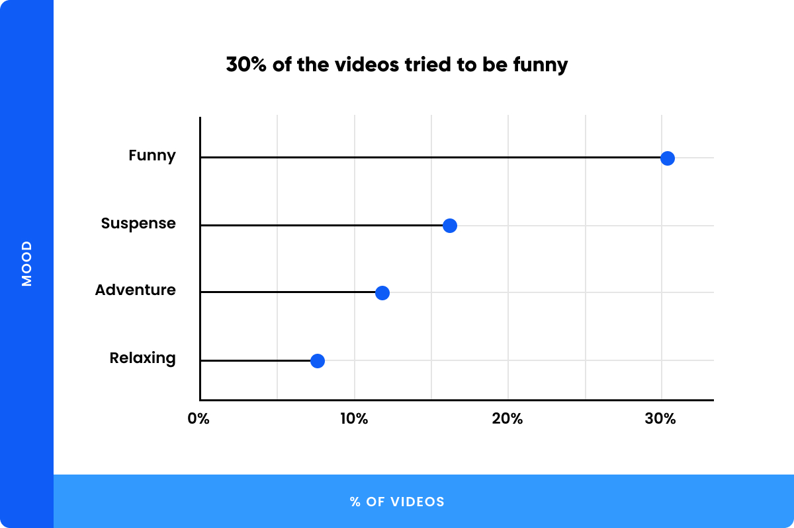


With that said, laughter is the best medicine and the data we have shows precisely that. **30% of the videos we studied employed humour** in some form or the other.

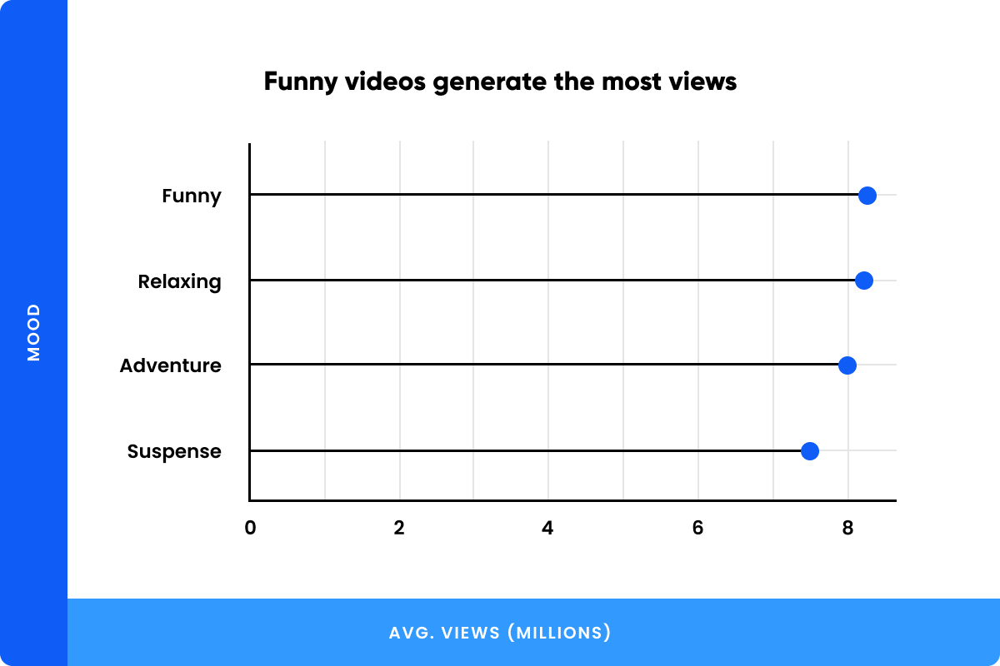


Funny videos rule TikTok, and they also generate the most views. They're also applicable to almost all brands and a great fallback for when you can't quite decide what to do with your next video --- unless you own a funeral parlour, in which case please don't try to be funny.

**Key takeaway:** The mood of your videos will depend on the brand image you're trying to curate, but it's (almost) never a bad idea to crack a joke or two.

### Which videos styles are the most successful?

Another important element to consider when planning your posts is which styles to use. TikTok, of course, offers a wide variety of filters, graphic overlays, and many other kinds of special effects for you to spruce up your video.

Far too many for us to study, in fact, but we did look at some of the more basic types of styles being used by TikTok creators and how well they do in practice. 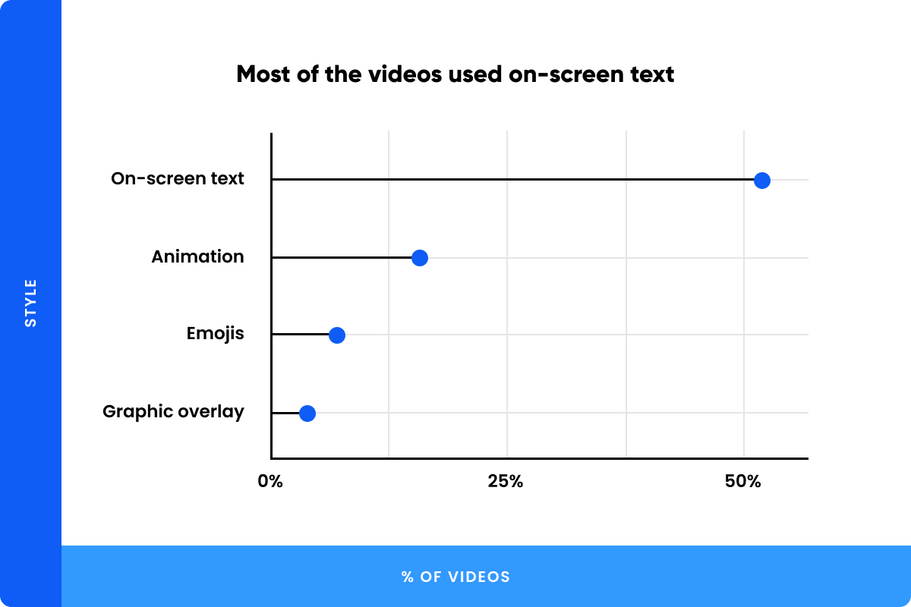


Unsurprisingly, a **majority of the videos included on-screen text**. Not only is it an excellent way for you to add side notes and commentary to your video, but it's also a great mechanism for you to add a call to action or other minor details like promo codes or deals to your post without having to explicitly say everything.

Animations were used in approximately 16% of the videos, while emojis were surprisingly not very popular.

Graphic overlays were the **least popular style**, with only 3.9% of the videos using one, but they did draw the **largest number of views compared to other styles**.

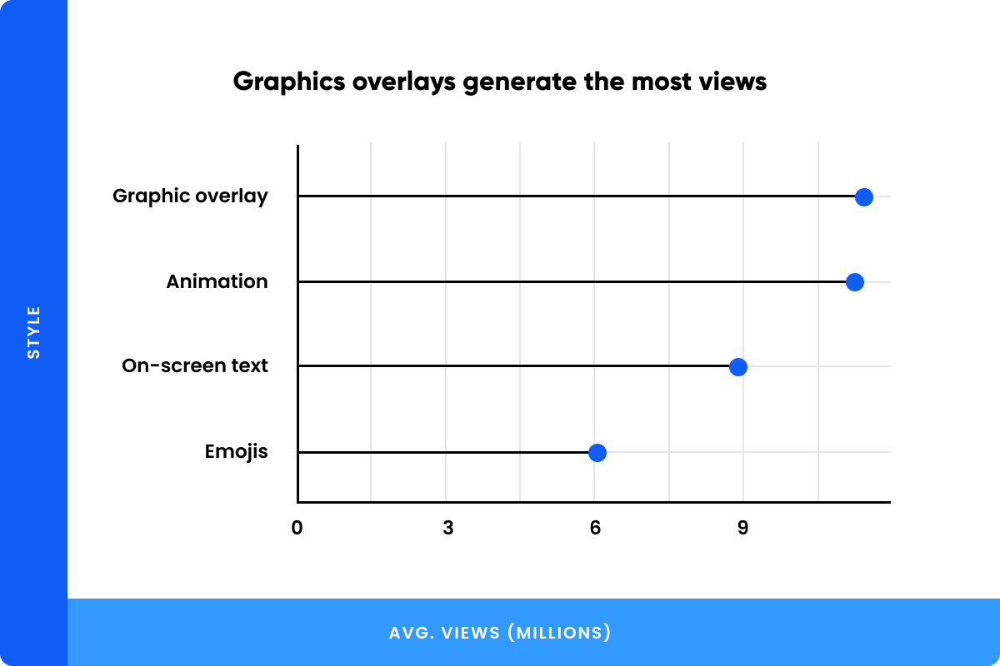


Animated videos also tend to draw large numbers of views (11.3 million views on average), proving once again that TikTok rewards creativity and free expression.

**Key takeaway:** Be creative in your choice of styles and use on-screen text to communicate the less important information.

## Other Interesting Tidbits


Here are a few other interesting stats we found:

-   **Video descriptions were 87 characters** long on average (TikTok imposes a 150-character limit).

-   Videos descriptions had **3.26 hashtags on average**.

-   87.3% of the videos had at least one hashtag.

-   Every **100 views generate 12 engagements** on average, where engagements are defined as the sum of likes, comments, and shares.

## Conclusion

[**TODO:** Add a link to methodology. Since we didn't create a separate data report for this study, that's something that requires some thought. Need to consult with Daniel on this.]

If you've found this guide useful, we'd love it if you could share it with your friends and colleagues who are looking to leverage TikTok for their brands.

For those that want to learn more about how we conducted this research, here's a link to our methods and the raw data used for this analysis.

What was your \#1 takeaway from this guide? Let us in the comments below!

## Key Takeaways

-   **50% of the top brands we studied had no TikTok presence**, including billion-dollar brands like Google, Facebook, YouTube, and IKEA.
-   The best-performing TikTok brands **post 3.52 times per week** on average.
-   A **1% increase in followers corresponds to a 0.65% increase in average views per post**.
-   **80% of the top videos had music**, with upbeat songs being the most popular music choice by far.
-   Tech, Food, and Gaming brands have the **highest average views per video**.
-   Among the brands we studied, **So Satisfying, Samsung, TikTok, Chevrolet, and Flighthouse were the 5 most popular brands** in terms of average views per video.
-   **5 of the top 10 videos** were created by TikTok itself.
-   **90% of the videos** we studied had product placement, while **30% of the videos employed humour**.
-   Approximately **25% of the videos featured either a celebrity or an influencer**.
-   **Videos promoting brand events drew nearly 20 million views**, while those featuring some form of sexuality or animals also generated well **over 10 million views**.
-   Creative videos with animations and graphics overlays tend to draw over **11 million views per post**.

## TODO

1.  Add link in conclusion section.
